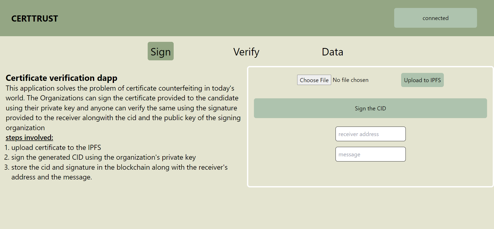
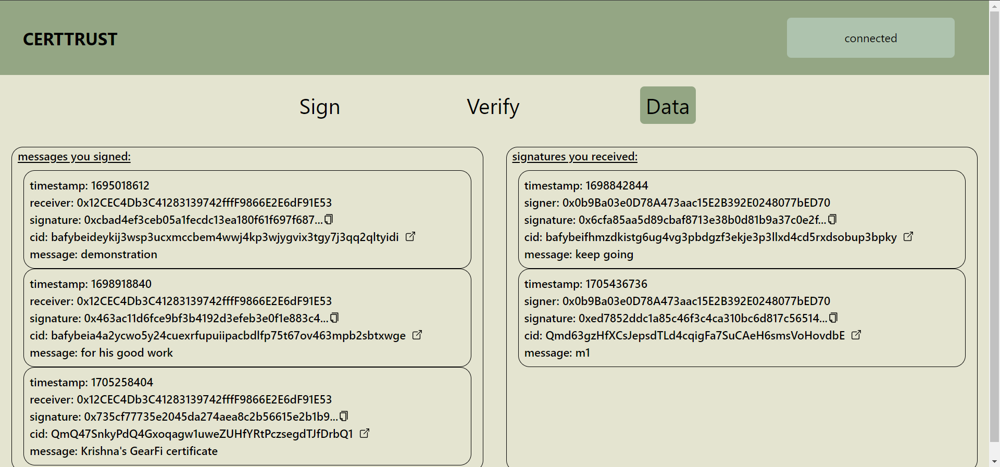

# CertTrust 

This is a tool to identify the authenticity of a certificate

How it works:
- organization signs the certificate and saves it to the blockchain alongwith writing the address of the receiver so that the receiver could also access it.
- anyone can check weather the certificate has been provided by the organization by entering the cid, signature and the address of the organization. This will result in either true/false.

